# 📑 Repositório referente a displina ALGORITMOS E ESTRUTURAS DE DADOS II - 2025.2

---

## 🚀 Projeto referente a primeira unidade

### 📊 Análise de Grafos - Bolsistas de Iniciação Científica

Este repositório contém a exploração e análise de grafos derivados da base de dados de bolsistas de iniciação científica da UFRN.  
O estudo busca compreender as relações entre bolsistas, orientadores e unidades acadêmicas a partir da modelagem em grafos.

#### 🔑 Principais Grafos

- **Co-occurrence Graph** → Ele representa a rede semântica de palavras mais frequentes e suas coocorrências.  
- **Bipartite Graphs** → Conectam dois tipos diferentes de nós, como `Bolsista-Unidade` ou `Discente-Orientador`.  
- **Advisor Collaboration Graph** → Rede de colaboração entre orientadores que compartilham bolsistas.  

#### 🚀 Tecnologias Utilizadas

- **Python** (pandas, numpy)
- **NetworkX** (modelagem e análise de grafos)
- **Plotly** (visualização interativa)
- **NLTK / scikit-learn** (pré-processamento de texto)

#### 📌 Funcionalidades Implementadas

- Pré-processamento dos dados (limpeza e normalização).  
- Criação de diferentes tipos de grafos (direcionados, ponderados, bipartidos, etc.).  
- Projeções de grafos bipartidos para diferentes perspectivas.  
- Cálculo de métricas de redes (grau médio, densidade, assortatividade, centralidade).  
- Inclusão de algoritmos para **detecção de comunidades**.  
- Visualizações otimizadas com **Plotly**.  

#### 📈Resultados

- Distribuição de graus dos grafos.  
- Identificação de orientadores mais centrais na rede.  
- Estrutura de colaboração entre unidades acadêmicas.
 
#

👩‍💻 Desenvolvido por Laura Marcelino no contexto de análise de grafos aplicados a dados de bolsistas de iniciação científica.

#### 📊 Dados

A base de dados utilizada neste projeto está disponível em:

- [Portal de Dados da UFRN - Bolsistas de Iniciação Científica](https://dados.ufrn.br/dataset/bolsistas-de-iniciacao-cientifica/resource/dfee756f-809f-42d2-a88a-db67f3a040bf)  

#### 🚀 Execução no Google Colab

Você pode vizualizar este projeto diretamente no Google Colab:  

As células já estão executadas mas caso seja necessário reproduzi-las, no ambiente google colab, baixe o arquivo `bolsistas-iniciacao-cientificia.csv` da pasta`u1/data` e suba na opção *Files* em seguida clique em *Upload session storage*, após fazer isso execute as células, em ordem, normalmente.

#### 📊 Apresentação

A apresentação do projeto pode ser acessada clicando no link abaixo:

[Ver apresentação no Canva](https://www.canva.com/design/DAGzJpx-3dM/FZRI1eylc88T51enXIlYNw/view)

---

## 🚀 Projeto referente segunda unidade

### 📊 TRABALHO 1 - Comparação de Performance: Dijkstra Clássico vs Dijkstra com Min-Heap

#### 🚀 Visão Geral do Projeto

Este projeto tem como objetivo realizar uma **análise comparativa aprofundada** do desempenho e da **pegada de carbono ($\text{CO}_{2}$)** de diferentes implementações do algoritmo de caminho mínimo de Dijkstra.

O foco é contrastar as implementações baseadas em diferentes estruturas de dados e complexidades teóricas: a **versão clássica $O(V^2)$** e a **versão otimizada com Min-Heap $O((V+E) \log V)$**, utilizando a implementação nativa do **NetworkX** como referência.

#### Objetivos Principais

* **Avaliar a Complexidade Prática:** Medir como o tempo de execução e as emissões de $\text{CO}_{2}$ escalam em função do número de nós ($V$).
* **Comparar Eficiência Energética:** Utilizar a biblioteca **CodeCarbon** para quantificar a pegada de carbono de cada abordagem.
* **Validação Estatística:** Coletar dados de forma robusta e calcular o Intervalo de Confiança (95%) para garantir a validade dos resultados.

#

#### 🛠️ Tecnologias e Dependências

O projeto é executado em um ambiente Python e depende das seguintes bibliotecas:

| Biblioteca | Propósito |
| :--- | :--- |
| **`networkx`** | Geração dos grafos aleatórios (G(n, p)) e algoritmo de referência. |
| **`numpy`**, **`pandas`** | Manipulação de dados, cálculos e análise estatística. |
| **`matplotlib`** | Geração dos gráficos de comparação de desempenho. |
| **`tqdm`** | Barras de progresso para monitorar o loop de experimentos. |
| **`codecarbon`** | Medição da pegada de carbono (kg CO₂e) de cada execução do algoritmo. |
| **`scipy.stats`** | Cálculo dos Intervalos de Confiança (distribuição *t* de Student). |

As implementações de Dijkstra (Clássico e Min-Heap) são carregadas de notebooks externos (`dijsktra.ipynb` e `dijsktra_min_heap.ipynb`, presentes na pasta `u2/p1/algoritmos`).

#

### ⚙️ Configuração Experimental

O experimento é projetado para garantir robustez estatística e reprodutibilidade:

#### Parâmetros

* **Tamanhos de Grafo ($V$):** `[100, 500, 1.000, 5.000, 10.000, 50.000, 100.000]` (Ajuste a lista `TAMANHOS` conforme a capacidade do seu ambiente).
* **Probabilidade de Aresta ($p$):** A probabilidade de arestas é ajustada dinamicamente de acordo com o tamanho do grafo usando a função edge_prob_ideal, baseada em log(N)/N.
* **Repetições por Tamanho:** 15 a 20 repetições.
* **Nós Fonte por Repetição:** 5 nós aleatórios.
* **Reprodutibilidade:** Sementes (`SEED`) fixadas para `random` e `numpy`.

#### Metodologia

1.  **Geração do Grafo:** Para cada tamanho $V$, um grafo ponderado e **conectado** é gerado.
2.  **Medição:** Para cada repetição e cada nó fonte, o tempo de execução e o $\text{CO}_{2}$ são medidos para:
    * Dijkstra Clássico (O(V²))  
    * Dijkstra Min-Heap (O((V+E) log V))
    * NetworkX Referência
3.  **Coleta de Dados Brutos:** Os resultados de todas as execuções são agregados no arquivo `resultados_brutos.csv`.

#

### 📈 Resultados e Análise

O notebook gera dois tipos de saídas para análise:

#### 1. Tabelas de Resumo

| Arquivo | Conteúdo |
| :--- | :--- |
| `resultados_brutos.csv` | Registros de Tempo (s) e $\text{CO}_{2}$ (kg) para cada execução individual (Tamanho, Repetição, Algoritmo). |
| `estatisticas_resumo.csv` | Resumo estatístico, incluindo **Média**, **Desvio Padrão** e **Intervalo de Confiança (95%)** para Tempo e $\text{CO}_{2}$, agrupados por Tamanho e Algoritmo. |

#### 2. Gráficos Comparativos

Os gráficos (com eixos logarítmicos) demonstram a relação entre o tamanho do grafo ($V$) e as métricas de desempenho/sustentabilidade, utilizando o Desvio Padrão ($\sigma$) como barra de erro.

* **`tempo_comparacao.png`**: Compara o **Tempo Médio de Execução (s)** dos três algoritmos.
* **`co2_comparacao.png`**: Compara a **Pegada de Carbono Média (kg CO₂e)** dos três algoritmos.

#

#### 💡 Como Executar o Projeto

1.  **Pré-requisitos:** Certifique-se de que as implementações de Dijkstra de aula (`dijsktra.ipynb` e `dijsktra_min_heap.ipynb`) estão disponíveis e que as dependências do `pip` foram instaladas.
2.  **Configuração:** Ajuste a lista `TAMANHOS` (Célula 2) e o número de repetições (`N_REPETICOES`) conforme a capacidade do seu ambiente.
3.  **Execução:** Execute todas as células do notebook **em ordem**.
4.  **Análise:** Inspecione os arquivos `.csv` e `.png` gerados para tirar conclusões sobre o *trade-off* entre a complexidade teórica e o consumo de recursos (tempo e energia) na prática.

Você pode vizualizar este projeto diretamente no Google Colab:  

#### 🎥 Apresentação / Vídeo

O projeto também conta com um vídeo explicativo mostrando:  

- Algoritmos e diferenças de complexidade  
- Execução dos notebooks  
- Gráficos e análise de resultados  

#### 📊 Referências

- [NetworkX Documentation](https://networkx.org/documentation/stable/)  
- [CodeCarbon](https://codecarbon.io)

---

### 📊 TRABALHO 2 - Interligando Pontos de Interesse(POIs) com A* e MST

#### 🚀 Visão Geral do Projeto
Este projeto tem como objetivo estimar **quantos quilômetros são necessários para interligar um conjunto de pontos de interesse (POIs)** em diferentes cidades, utilizando **rotas reais da malha viária** obtidas com **OSMnx** e algoritmos clássicos de **A*** e **Árvore Geradora Mínima (MST)**.

A análise combina:
- **A\*** (A-star) → para encontrar os **caminhos mínimos reais** entre cada par de POIs na cidade; 
- **Kruskal (MST)** → para determinar o **conjunto mínimo de conexões** que liga todos os POIs com o menor custo total (em km).

O projeto foi desenvolvido com base nos notebooks de referência: 
- `u2/d2/algoritmos de referencia/Astar.ipynb` 
- `u2/d2/algoritmos de referencia/kruskal_natal.ipynb`

#

#### 🧩 Objetivos

1. **Modelar o grafo viário** das cidades com OSMnx. 
2. **Definir POIs** relevantes em cada cidade (como universidades, praças, arenas, parques, museus, etc.). 
3. **Calcular as rotas mais curtas (A\*)** entre todos os pares de POIs, considerando a malha viária real. 
4. **Construir o grafo completo de POIs** com pesos baseados nos custos A\*. 
5. **Gerar a Árvore Geradora Mínima (MST)** com base nos custos de A\*, para obter o comprimento total mínimo necessário para conectar todos os POIs. 
6. **Comparar o resultado entre 8 cidades diferentes**, analisando o total em quilômetros e padrões de conectividade. 

#

#### 🏙️ Cidades analisadas

1. Natal – Brasil 
2. Paris – França 
3. Los Angeles – Estado Unidos 
4. Roma – Itália 
5. Manhattan – Estados Unidos 
6. Osaka – Japão 
7. Cairo – Egito 
8. Sydney– Austrália 

#

#### ⚙️ Metodologia

O processo de análise foi dividido nas seguintes etapas, aplicadas a cada cidade estudada:

##### 1) Escolha dos Pontos de Interesse (POIs)

Para esta análise, escolhemos a categoria **"Museus"** (`tourism: museum`) como nossos Pontos de Interesse (POIs). Esta escolha difere do Notebook-base II (que usou hospitais/escolas) e permite uma comparação interessante entre centros culturais de diferentes cidades.

##### 2) Grafo Viário da Cidade

Utilizamos a biblioteca `OSMnx` para baixar a malha viária (rede do tipo `drive`) de cada cidade. Para garantir a precisão nos cálculos de distância, o grafo foi projetado para o sistema de coordenadas métrico **UTM** (`ox.project_graph`). Para cada POI (museu) encontrado, identificamos o nó (`node`) mais próximo na malha viária projetada usando `ox.distance.nearest_nodes`.

##### 3) Rotas Mais Curtas com A*

Para construir um grafo de conexões entre os POIs, foi necessário calcular a distância real pela malha viária entre todos os pares de POIs. Utilizamos o algoritmo **A*** (`networkx.astar_path`) com o peso (`weight`) definido como `length` (comprimento da via).

Como heurística para o A*, utilizamos a **distância Euclidiana** (`euclidean_dist_heuristic`) no plano projetado (UTM). Esta heurística é admissível (nunca superestima o custo real) e consistente, garantindo que o A* encontre o caminho mais curto de forma eficiente. O custo (distância) e a rota (lista de nós) de cada par foram armazenados.

##### 4) MST sobre o Grafo Completo de POIs

Com os custos A* calculados, um novo grafo completo foi criado, onde os vértices são os nós dos POIs e as arestas são ponderadas pela distância A* entre eles.

Sobre este grafo completo, calculamos a **Árvore Geradora Mínima (MST)**, utilizando o algoritmo de Kruskal (`networkx.minimum_spanning_tree`). A soma dos pesos das arestas desta MST representa o "comprimento total mínimo" necessário para garantir que todos os museus da cidade estejam conectados pela rede viária.

##### 5) Comparação entre Cidades

Os passos 1 a 4 foram repetidos para 8 cidades distintas (incluindo Natal) para permitir uma análise comparativa.

#

#### 🛠️ Tecnologias e Dependências

* **Python 3.x**
* **OSMnx:** Para aquisição e modelagem de dados do OpenStreetMap.
* **NetworkX:** Para análise de grafos, implementação do A* e do algoritmo da MST (Kruskal).
* **Pandas & GeoPandas:** Para manipulação de dados geoespaciais (POIs).
* **Matplotlib:** Para visualização dos grafos e das rotas.
* **Numpy:** Para cálculos numéricos.

#### 📈 Resultados

##### Visualizações

O notebook principal (`challenge.ipynb`) gera as visualizações da malha viária de cada cidade, destacando em vermelho a união das rotas A* que compõem a MST, e em verde-limão os POIs (museus) conectados.
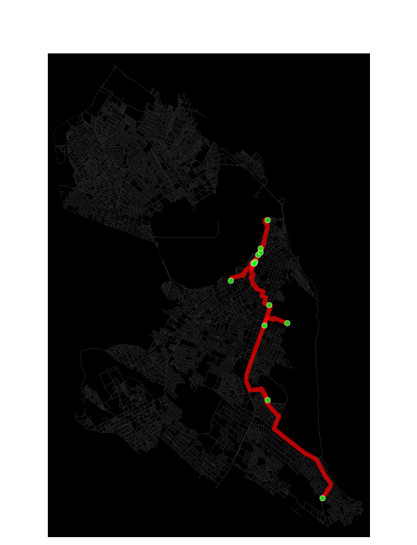
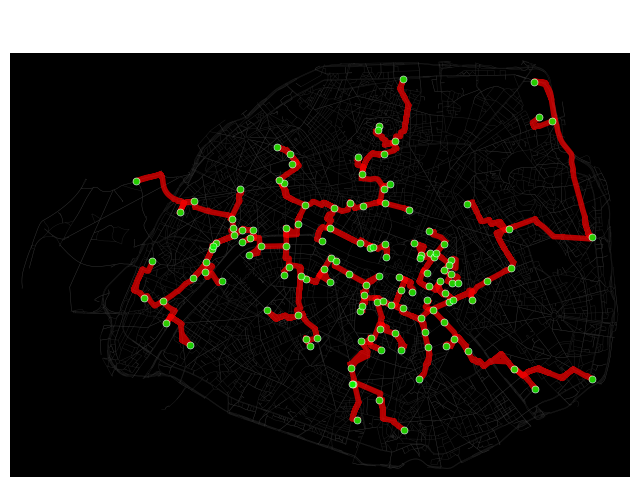
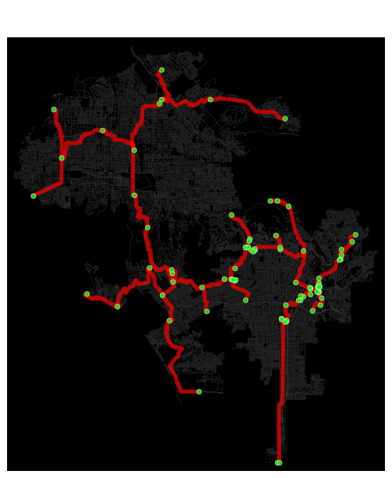
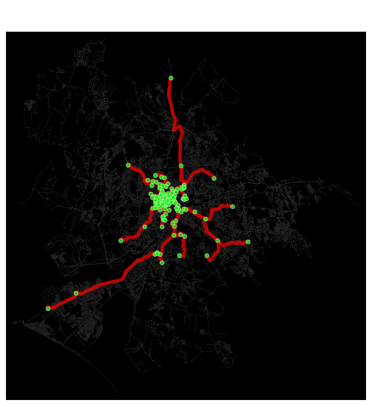
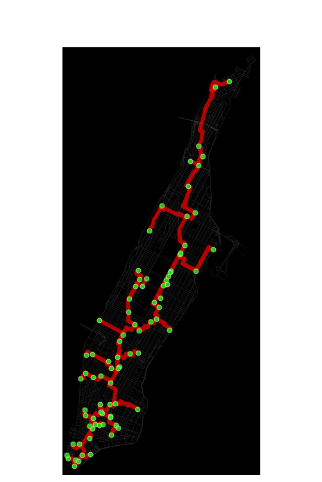
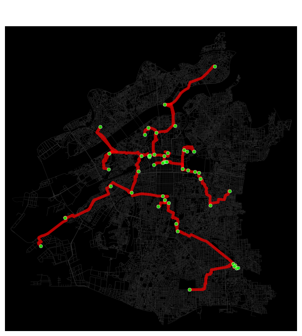
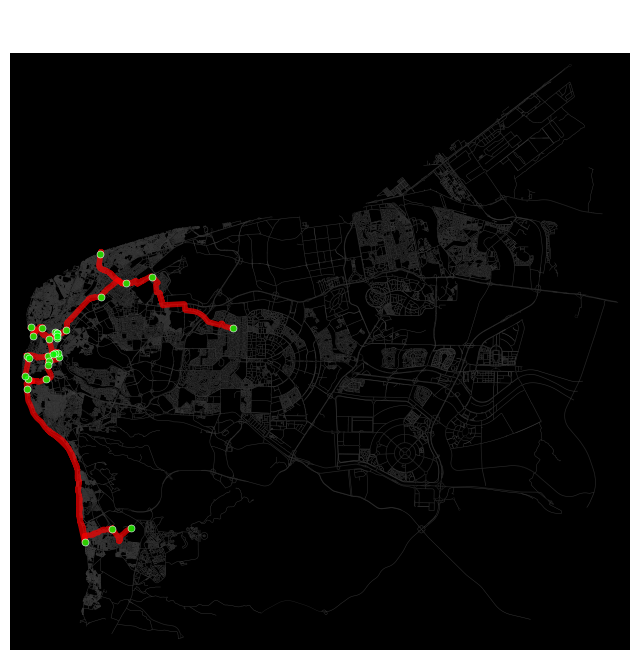
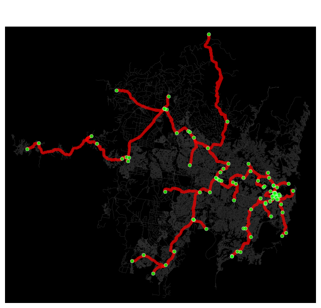

###### Tabela Comparativa Consolidada

A tabela a seguir consolida as métricas obtidas para a categoria "Museus" nas 8 cidades analisadas. As cidades estão ordenadas pelo comprimento total da MST.

| Cidade | POIs Conectados | Comprimento MST (km) | Arestas na MST | Média km/POI | Média km/Aresta |
| :--- | ---: | ---: | ---: | ---: | ---: |
| Natal, Brazil | 13 | 19.63 | 12 | 1.51 | 1.64 |
| Paris, France | 135 | 77.36 | 134 | 0.57 | 0.58 |
| Los Angeles, USA | 88 | 240.13 | 87 | 2.73 | 2.76 |
| Roma, Italy | 131 | 143.23 | 130 | 1.09 | 1.10 |
| Manhattan, NYC | 83 | 53.83 | 82 | 0.65 | 0.66 |
| Osaka, Japan | 48 | 63.64 | 47 | 1.33 | 1.35 |
| Cairo, Egypt | 32 | 83.77 | 31 | 2.62 | 2.70 |
| Sydney, Australia| 93 | 448.10 | 92 | 4.82 | 4.87 |

###### Estatísticas Gerais

| Métrica                   | Valor (km) |
| :------------------------ | ---------: |
| Média (km/POI)            |   **1.91** |
| Desvio Padrão (km/POI)    |   **1.42** |
| Média (km/Aresta)         |   **1.96** |
| Desvio Padrão (km/Aresta) |   **1.44** |

#

#### 📊 Análise Crítica

Este projeto estimou o comprimento mínimo de malha viária necessário para interligar museus em oito cidades globais. A metodologia combinou a busca A* (para distâncias reais) com uma Árvore Geradora Mínima (MST) para otimizar a conexão total.

Os resultados da tabela comparativa revelam uma forte correlação entre a estrutura urbana e o custo de conexão. Cidades historicamente densas e "compactas", como Roma e Paris, apresentaram os menores comprimentos de MST. Nesses locais, os museus (POIs) estão geograficamente agrupados em centros históricos, exigindo menos quilômetros de infraestrutura para serem interligados.

Em contraste, cidades conhecidas pela expansão urbana (urban sprawl), como Los Angeles e Sydney, exibiram os maiores comprimentos de MST e, notavelmente, as maiores médias de "km/Aresta". Isso indica que os POIs estão muito mais dispersos, e a rede viária que os conecta é, por natureza, mais longa. Cidades como Manhattan e Tóquio, apesar de densas, possuem áreas geográficas maiores, resultando em valores intermediários.

**Limitações do Método:** A escolha do POI é crucial; usar "aeroportos" em vez de "museus" mudaria drasticamente os resultados. A metodologia de "nó mais próximo" (`nearest_nodes`) é uma simplificação que ignora a acessibilidade real (ex: a entrada de um museu pode estar longe do nó viário mais próximo). Além disso, a conversão do grafo para não-direcionado (necessária para a MST) ignora restrições de sentido único, o que pode subestimar ligeiramente as distâncias reais do A* se o grafo 'drive' original fosse usado de forma estritamente direcionada.

#### 💡 Como Executar o Projeto

As células já estão executadas mas caso seja necessário reproduzi-las, basta baixar o notebook `T2U2` e executar as células em ordem.

Você também pode vizualizar este projeto diretamente no Google Colab:  

#### 🎥 Apresentação / Vídeo

O projeto também conta com um vídeo explicativo mostrando:  

- Explicação do código
- Execução da célula principal
- Deploy da rede

---

## 🚀 Projeto referente a terceira unidade

### 📊 Análise de Redes Complexas da Wikipedia

### 👩‍💻 Autora
Laura Marcelino

### 🎯 Objetivo
Este projeto tem como objetivo analisar uma **rede de estruturas complexas** construída a partir de links da **Wikipedia**, utilizando **bibliotecas em Python** e o software **Gephi**.  
A análise é baseada em **métricas de centralidade**, **estrutura de núcleos (k-core / k-shell)** e **detecção de comunidades**, conforme os conteúdos estudados nas **Semanas 10 e 11 do curso**.

A rede foi construída a partir de múltiplas páginas iniciais (*seeds*), explorando os links internos da Wikipedia até o **nível 2 (altura < 3)**.

#

### 🗂 Base de Dados
A base de dados utilizada é uma **rede de links da Wikipedia**, construída dinamicamente por meio da biblioteca `wikipedia` em Python.

#### Seeds utilizadas:
- **Complex network**
- **Artificial intelligence**
- **Brazil**
- **Quantum mechanics**
- **Vincent van Gogh**

As redes geradas a partir dessas seeds são **fundidas em um único grafo direcionado**, formando uma estrutura complexa heterogênea.

#

### ⚙️ Metodologia

#### 🔹 Construção da Rede
- Grafo modelado como **direcionado** (`DiGraph`)
- Estratégia de busca **BFS (Breadth-First Search)**
- Profundidade máxima: **nível 2**
- Heurística para controle de crescimento:
  - Limitação do número de links explorados por página
- Uso de **cache local** para evitar requisições repetidas à Wikipedia
- Tratamento de páginas ambíguas (*DisambiguationError*)

#### 🔹 Limpeza e Pré-processamento
- Remoção de *self-loops*
- Remoção de páginas de identificadores (DOI, ISBN, ISSN, etc.)
- Normalização de títulos
- Remoção opcional de nós com grau muito baixo
- Tratamento de atributos incompatíveis com o formato GraphML

#

### 📊 Métricas de Rede
As seguintes métricas foram calculadas e adicionadas como atributos dos vértices:

- **Degree (Grau)**
- **Betweenness Centrality**
- **Closeness Centrality**
- **PageRank**
- **Eigenvector Centrality**
- **k-core / k-shell**

Essas métricas permitem identificar:
- Nós mais influentes
- Nós intermediários importantes
- Regiões densamente conectadas
- Estrutura hierárquica da rede

A seguir estarão disponíveis imagens das métricas que foram calculadas usando o Gephi:

**Degree Distribution**

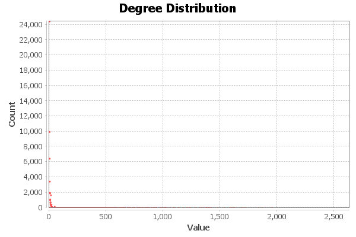

- Distribuição do grau total (in-degree + out-degree) dos nós. O gráfico mostra uma forte concentração de nós com grau muito baixo (próximo de zero), com um pico de contagem acima de 22.000, sugerindo uma rede esparsa ou desigual onde a maioria dos nós tem poucas conexões.

**In-Degree Distribution**

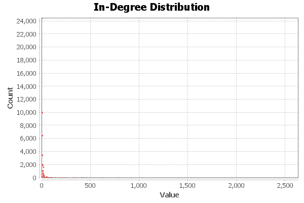

- Distribuição do grau de entrada (número de arestas apontando para o nó). O gráfico é altamente concentrado em valores baixos, com um pico de contagem em torno de 10.000 para nós com in-degree próximo de zero. Isso sugere que a maioria dos nós recebe poucas conexões.

**Out-Degree Distribution**

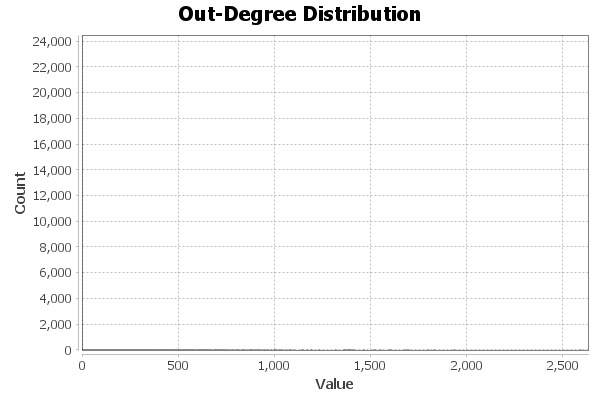

- Distribuição do grau de saída (número de arestas que saem do nó). O gráfico mostra uma distribuição mais plana e muito baixa em comparação com o in-degree, com a maioria dos nós tendo um out-degree baixo (próximo de zero). A contagem não ultrapassa 1.000 para a maioria dos valores de grau, o que sugere que a maioria dos nós aponta para poucas outras entidades.

**Betweenness Centrality Distribution**

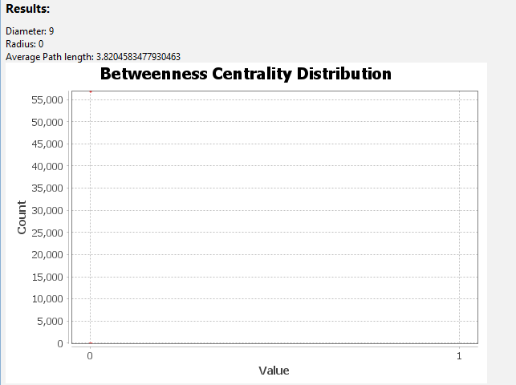

- Distribuição do grau de saída (número de arestas que saem do nó). O gráfico mostra uma distribuição mais plana e muito baixa em comparação com o in-degree, com a maioria dos nós tendo um out-degree baixo (próximo de zero). A contagem não ultrapassa 1.000 para a maioria dos valores de grau, o que sugere que a maioria dos nós aponta para poucas outras entidades.

**Closeness Centrality Distribution**

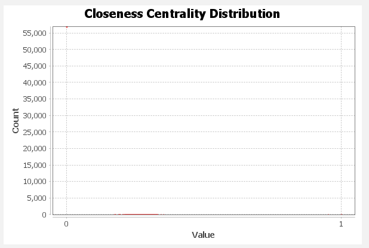

- Distribuição da Centralidade de Proximidade. O gráfico está altamente concentrado em valores muito baixos (próximos de zero), indicando que a grande maioria dos nós está longe do centro da rede.

**Harmonic Closeness Centrality Distributionn**

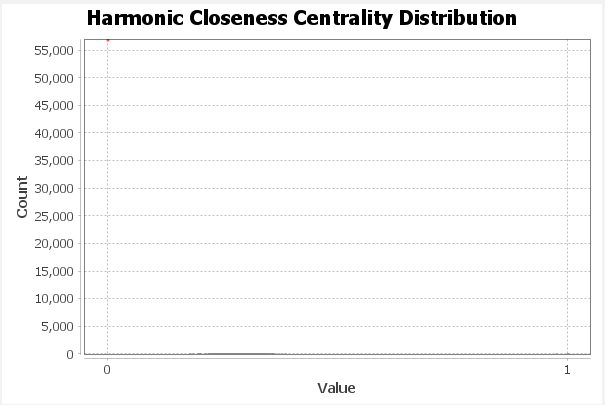

- Distribuição da Centralidade de Proximidade Harmônica. Esta métrica é uma variação da Centralidade de Proximidade, especialmente útil para grafos desconexos ou dirigidos (como é o caso desta rede). O gráfico mostra uma concentração extremamente alta de nós em valores muito baixos (próximos de zero), indicando que a grande maioria dos nós tem baixa proximidade harmônica, sugerindo que o custo de alcançar outros nós é alto para a maioria das entidades na rede.

**Eccentricity Distribution**

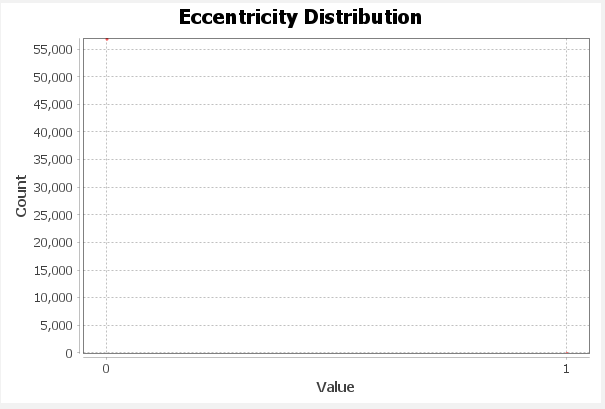

- Distribuição da Excentricidade. A excentricidade de um nó é a maior distância geodésica (caminho mais curto) entre ele e qualquer outro nó na rede. Assim como outras métricas de centralidade, este gráfico está massivamente concentrado em valores muito baixos (próximos de zero). Isso é incomum, pois sugere que o "nó mais distante" para a maioria dos nós está a uma distância muito curta. No entanto, em redes desconectadas (muitos SCCs), os valores são frequentemente definidos como zero ou muito baixos/altos, dependendo da implementação, o que reforça a natureza esparsa e segmentada da rede.

**Hubs Distribution**

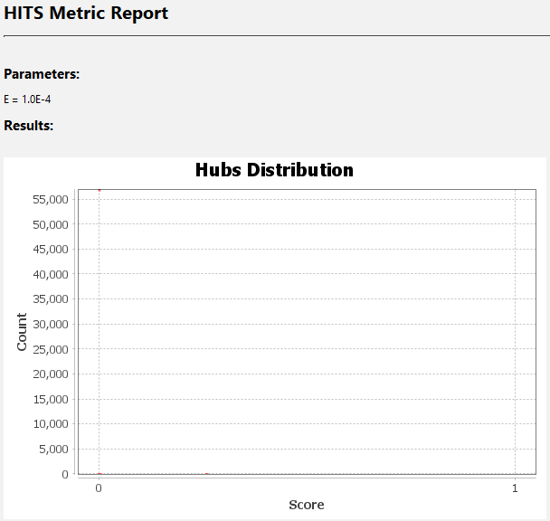

- Distribuição do escore de Hub (métrica HITS). O gráfico mostra uma concentração massiva de nós com escore de Hub próximo de zero, indicando que a grande maioria dos nós não serve como um índice ou agregador que aponta para muitas Autoridades.

**Authority Distribution**

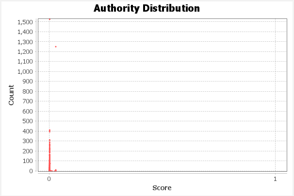

- Distribuição do escore de Autoridade (métrica HITS). O gráfico mostra uma concentração muito forte de nós com escore de Autoridade próximo de zero. Isso sugere que apenas um número muito pequeno de nós atua como fontes importantes de conteúdo/informação (Authorities).

**PageRank Distribution**

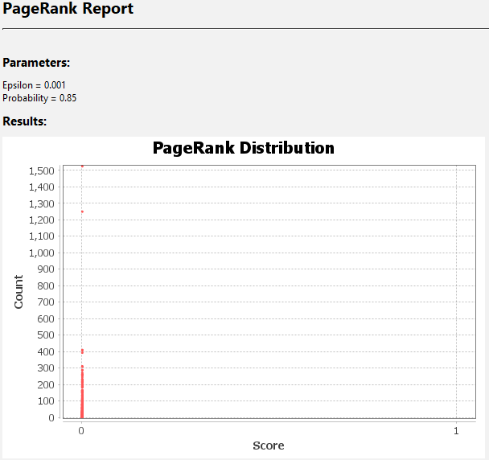

- Distribuição do escore de PageRank. O gráfico mostra uma concentração muito forte de nós com escore de PageRank próximo de zero, com picos de contagem acima de 1.500. Isso sugere que a maior parte da "importância" ou "popularidade" da rede está concentrada em poucos nós.

**Connected Components Reportn**

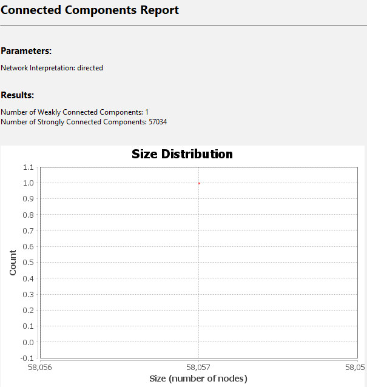

- Relatório sobre a conectividade do grafo. Indica que a rede tem apenas 1 Componente Fracamente Conectado (WCC), sugerindo que o grafo é globalmente conexo quando a direção das arestas é ignorada. No entanto, há 57.034 Componentes Fortemente Conectados (SCC), o que significa que a maioria dos nós está isolada ou em pequenos ciclos quando a direção das arestas é considerada. O gráfico de distribuição de tamanho mostra um pico grande (quase toda a rede) para o WCC, mas a escala de x está em torno de 58.057 nós.

**Modularity**

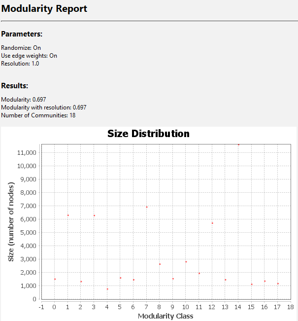

- Relatório da métrica de modularidade para detecção de comunidades. O resultado é uma Modularidade de 0.697, que é um valor alto (próximo de 1), indicando que a rede tem uma estrutura comunitária muito forte com conexões densas dentro das comunidades e conexões esparsas entre elas. Foram identificadas 18 Comunidades. O gráfico mostra a distribuição do tamanho dessas comunidades.
  
#

### 🧩 Detecção de Comunidades
A rede pode ser analisada no **Gephi** utilizando algoritmos de detecção de comunidades, como o **Modularity**.

Após a limpeza dos identificadores, surgem comunidades temáticas coerentes, tais como:
- Ciência e Inteligência Artificial
- Física e Mecânica Quântica
- Arte e História
- Geopolítica e Brasil

#

### 🎨 Visualização no Gephi

#### Requisito 01
- Tamanho dos vértices proporcional ao **grau**
- Cores associadas a métricas de centralidade  
  (Closeness, Betweenness ou Eigenvector)
- Layouts sugeridos:
  - **ForceAtlas2**
 
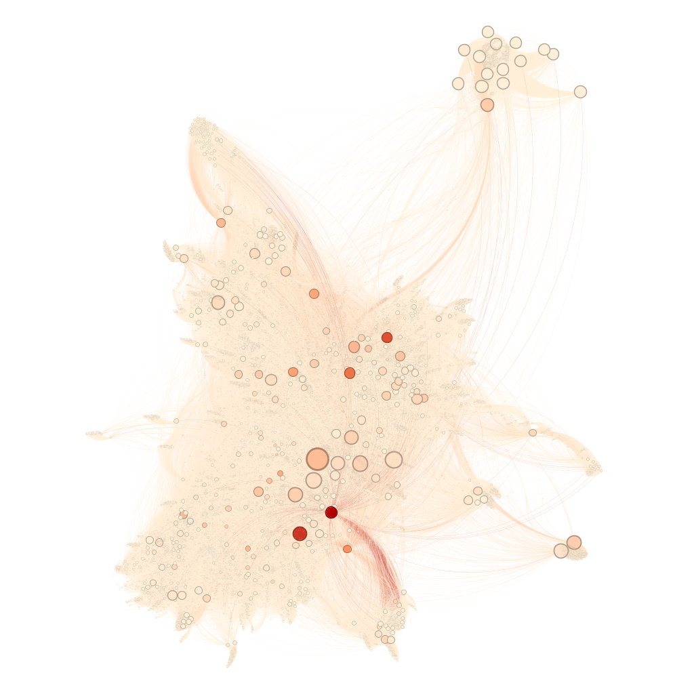
 
O layout ForceAtlas2 foi utilizado por permitir uma visualização clara da separação estrutural da rede. O tamanho dos vértices é proporcional ao grau, refletindo o número de conexões, enquanto as cores representam a centralidade de betweenness, evidenciando nós com papel de intermediação entre comunidades. Nós com maior betweenness aparecem em tons mais quentes, indicando maior importância como intermediários entre comunidades. Após adição de filtro, labels e melhor organização a rede ficou assim:

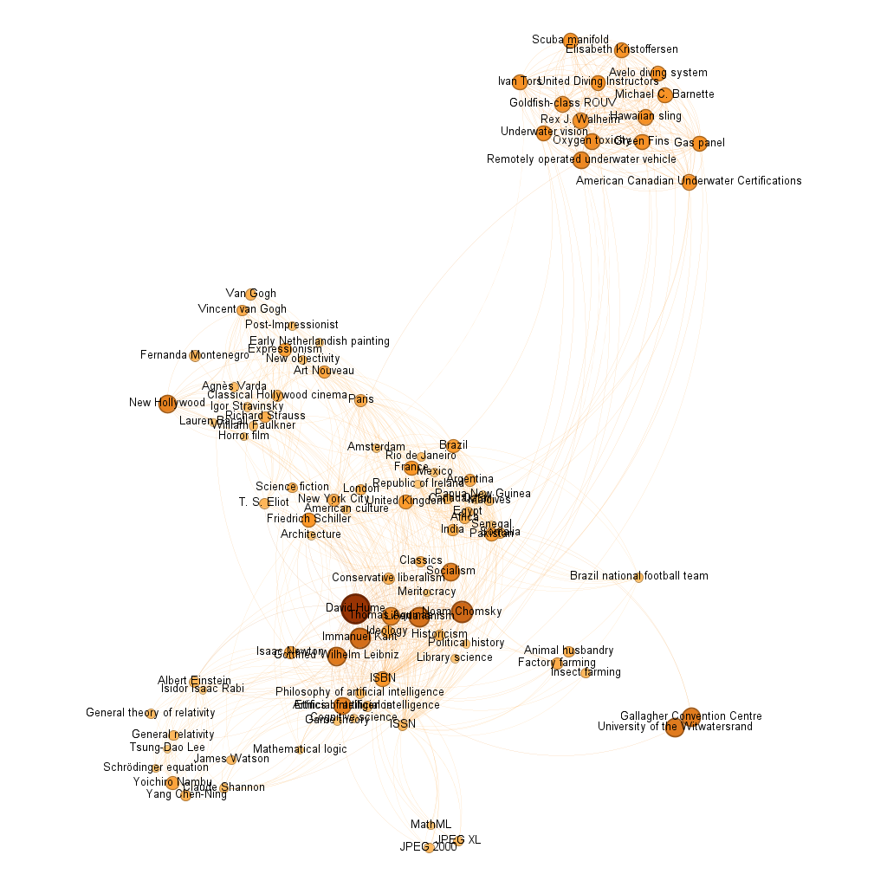
    
#### Requisito 02
- Destaque para **k-core / k-shell**
- Vértices com tamanho proporcional ao grau
- Visualização da estrutura interna da rede

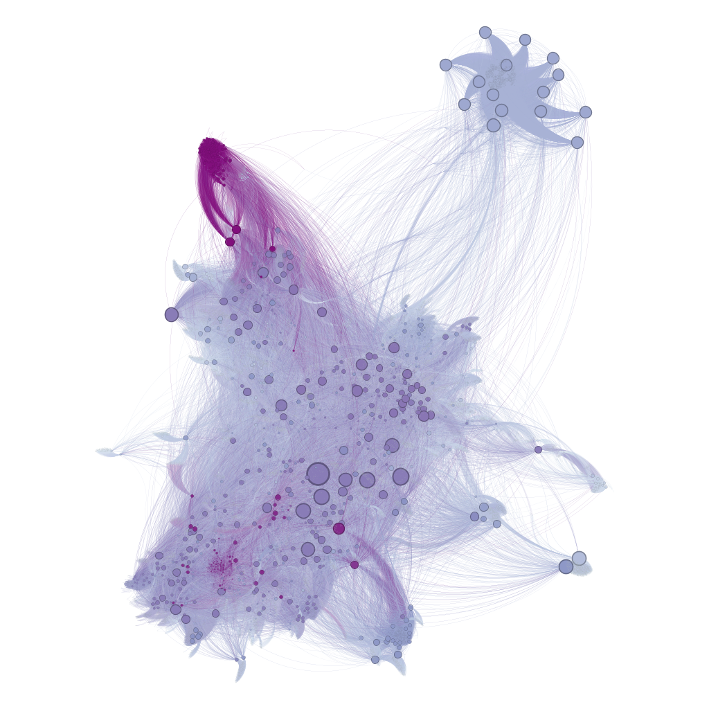

A decomposição k-core permitiu identificar o núcleo da rede, composto por nós altamente interconectados. Observa-se que os vértices pertencentes aos maiores k-cores concentram os principais hubs da rede, indicando maior robustez estrutural. Após aplicação de filtros, adicionar os labels e otimizar a posição dos nós afim de melhorar a visualização a rede ficou assim:

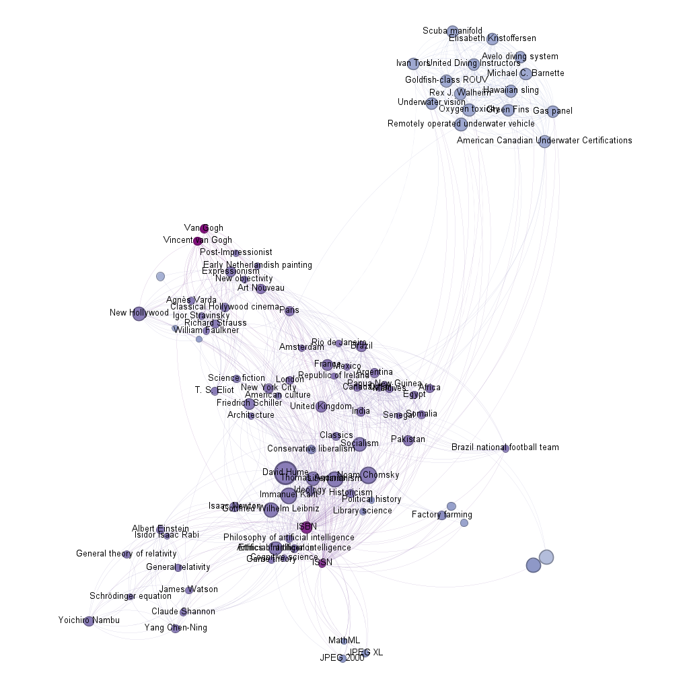

#### Requisito 03
- Visualização por **comunidades**
- Cores associadas às comunidades detectadas
- Tamanho do vértice definido por uma métrica de livre escolha

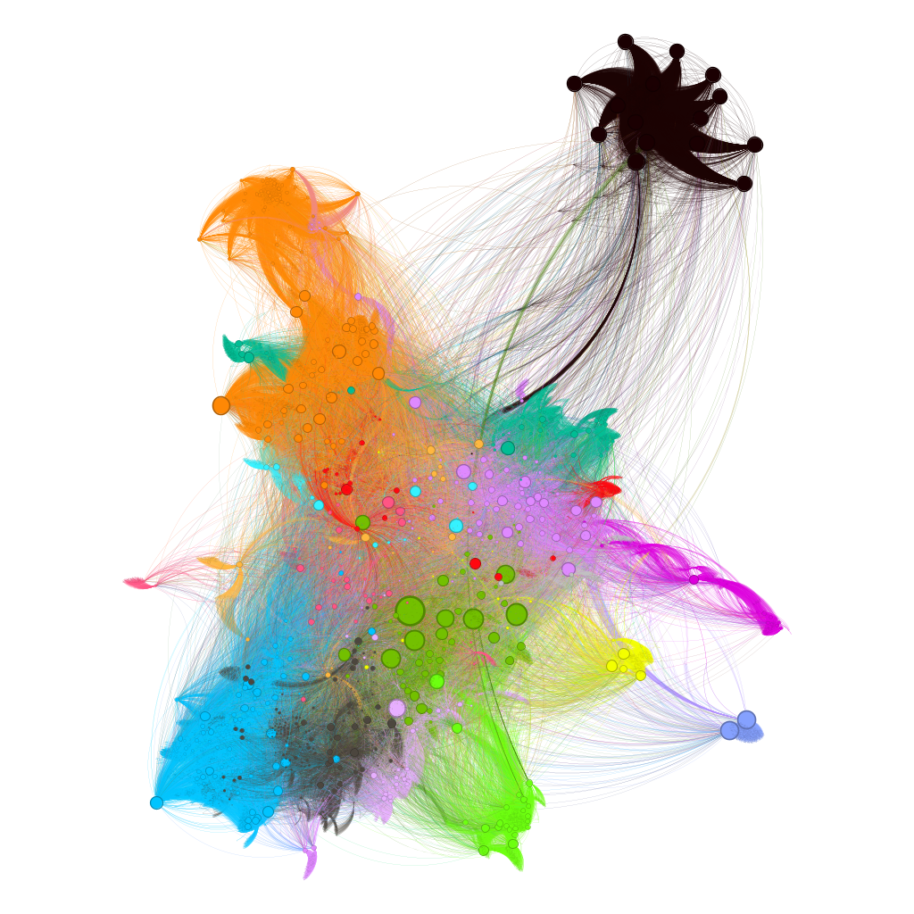

A detecção de comunidades foi realizada utilizando o algoritmo de modularidade. As cores representam diferentes comunidades estruturais da rede, enquanto o tamanho dos vértices reflete sua importância medida pelo PageRank. Após otimização a rede ficou da seguinte maneira:

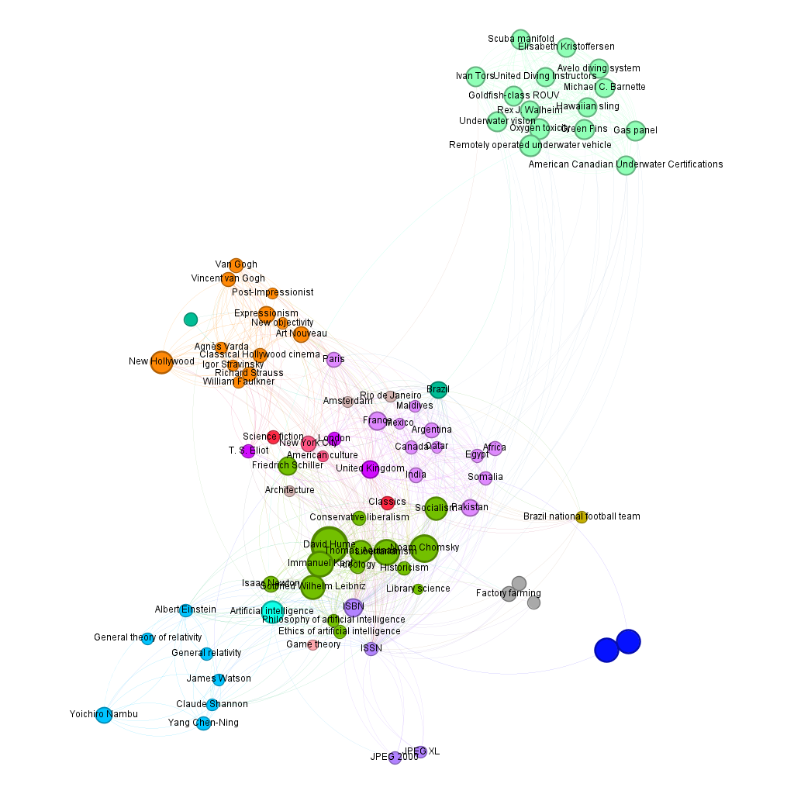

#

#### 🚀 Heurística e Otimização (Requisito 04)
A exploração da Wikipedia até o nível 2 gera elevada demanda computacional.  
Para tornar o processo viável, foram aplicadas as seguintes estratégias:

- Limitação do número de links por página
- Cache local em arquivos JSON
- Uso de estruturas de dados eficientes (`set`, `list`, `dict`)
- Pausas entre requisições para evitar sobrecarga da API

Essas heurísticas reduzem significativamente o tempo de execução e o número de requisições.

#### 💡 Como Executar o Projeto

As células já estão executadas mas caso seja necessário reproduzi-las, basta baixar o notebook `t3` e executar as células em ordem.

Você também pode vizualizar este projeto diretamente no Google Colab:  

Importando o HTML do gephi o deploy foi feito no github e pode ser acessado clicando aqui 👉  )

#

#### 🎥 Apresentação / Vídeo

O projeto também conta com um vídeo explicativo mostrando:  

- Execução dos notebooks
- Comparação entre Cidades
- Tabela Comparativa e Análise  

